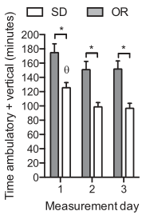
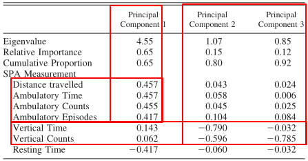
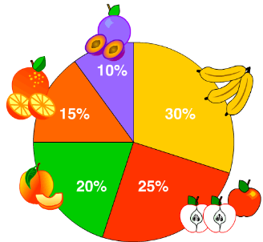
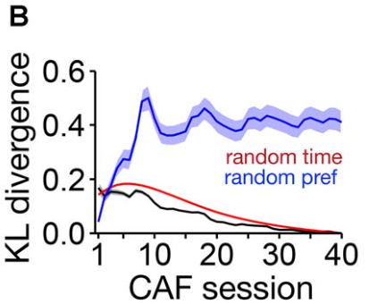

# Agenda

- Presentación general de la pregunta del laboratorio
- Técnicas específicas para contestar las preguntas de investigación
	- Modelamiento de la actividad física espontánea
	- Modelamiento de preferencias alimentarias
- Conclusión

# Pregunta de investigación central

- Vínculo entre función neural y comportamiento
- Variable independiente es de carácter 'biológico'
- Variable dependiente de carácter 'comportamiento'
- o viceversa
- Existen múltiples métodos de investigación

# Inhibir o extinguir una función neuronal

- Estudios de lesiones
- Estimulación magnética/eléctrica
- Manipulación de neurotransmisores
- Entre otras

# Aumentar una función neuronal

- Estimulación eléctrica
- Optogenética
- facilitación de la actividad neuronal

# Observando el vínculo

En el laboratorio se observan múltiples 'direccionalidades' derivadas de la pregunta central

- Aumentar/inhibir la función neural y observar cambios en el comportamiento
- Definir, dado un fenotipo de comportamiento, la dinámica neuronal
- Definir variables contextuales que modulan el comportamiento, tener un fenotipo de comportamiento dado y observar la dinámica neuronal

# El laboratorio en específico

- La pregunta en general, como se mencionó anteriormente, es el vínculo entre función neuronal y comportamiento
- La función neuronal de interés específico es la orexina
- Las medidas de comportamiento corresponden a las relacionadas con el balance calórico
	- Actividad física espontánea
	- Comportamiento de ingesta
	- Gasto energetico
	- Entre otras relacionadas
- Adicionalmente la pregunta incluye modulación del vínculo comportamiento-función-neuronal por elementos contextuales

# Técnicas asociadas a manipulación de la función neuronal y observar cambios en el comportamiento

La orexina es un neuropéptido, para el cual se ha vinculado la función de regulación de 'arousal', apetito, actividad física espontánea, actividad exploratoria, entre otras [@Z7PJ2NBV#Mavanji_Etal_2015]

@Z7PJ2NBV#Mavanji_Etal_2015 estudiaron la actividad  el sistema neuronal de orexina en el área ventrolateral pre-óptica para el control del gasto energético

# Técnicas asociadas a manipulación de la función neuronal y observar cambios en el comportamiento

- Manipulación de la función neuronal (variable independiente)
	- Inyección de orexina-A
	- Inyección de antagonista del receptor 2 de orexina (OX2R)

- Observar modificaciones en el comportamiento (variable dependiente)
	- Registro de los estados de comportamiento
		- NREM
		- REM
		- 'active wakefulness'
		- 'quiet wakefulness'
	- Registro de la actividad física espontánea

# Técnicas asociadas a manipulación de la función neuronal y observar cambios en el comportamiento

EL problema acá es observar el efecto de la orexina-A (función neuronal) sobre los registros de comportamientos anteriormente mencionados, para ello, lógicamente, es necesario saber el estado de comportamiento presente

# Determinación de estado de comportamiento bajo polisomnografía

- Se realiza implantación de un transmisor capaz de enviar señales con información de EEG y EMG
- Se realiza una transformada de Fourier a los datos obtenidos, utilizando un ancho de 'bin' determinado
- Se utiliza la banda delta, ya que es un marcador del 'sleep drive' (probabilidad de consumar el sueño en cualquier punto dado)
- Se evalúan el movimiento ocular rápido
- Entre otras medidas
- La información anterior es agregada y presentada a un evaluador para determinar el estado de comportamiento presente, dada dicha información

Para revisión de criterios específicos ver [@KILDFJME#Mavanji_Etal_2010]

# Medición de la actividad física espontánea

La actividad física espontánea (SPA) es aquél tipo de actividad no-estructurada de baja intensidad (estar de pie, movimiento de manos y pies, deambular, etc) [@5VILKIIC#eske_Etal_2014]

- Para su medición se ocupan cajas especialmente diseñadas con haces infrarrojos en los ejes x e y
- El eje z, para ratones, se ubica 2.5 cm por sobre el suelo y permite medir elevaciones del animal
- Gracias a lo anterior se puede medir el tiempo deambulando y tiempo 'de pie'
- Ambas medición dan un índice que estima el SPA

# Medición de la actividad física espontánea

{ width=20% }

Comparación mediante 't-test' del SPA para ratones 'resistentes a la obesidad' (OR) y ratones Sprague-Dawley (SD)

# Segmentación de la actividad física espontánea

Una de los problemas que podría surgir para evaluar la SPA, es que las medidas de comportamiento sean redundantes y por ende no se esté registrando apropiadamente la señal, por ejemplo, si la deambulación y pararse verticalmente es redundante o son medidas complementarias

# Segmentación de la actividad física espontánea

- Para lo anterior se puede utilizar una técnica de reducción de dimensionalidad tal como 'principal component analysis' (PCA)
- PCA nos entrega 'componentes' correspondientes a fuentes de variabilidad no-correlacionadas
- El primer componente da cuenta de la mayor cantidad de variabilidad de los datos, el segundo de la segunda mayor cantidad y así
- Adicionalmente, esto nos permite calcular los 'factor loadings':
	- Correlación entre las variables originales y cada uno de los componentes
	- Porcentaje de la varianza en la variable original explicado por un componente determinado
- Con ellos podemos determinar si distintos 'comportamientos' provienen de la misma o distinta fuente de variabilidad

# Ejemplo de hallazgo con la técnica anterior

{ width=40% }

Se observan las correlaciones de cada variable original con cada componente. Las correlaciones para medidas de 'deambulación' son altas para el componente 1, mientras que las de 'verticalidad' correlacionan sustancialmente con los componentes 2 y 3 [@5VILKIIC#Teske_Etal_2014]

# Técnicas para evaluar interacción de elementos contextuales, comportamiento y función neuronal

Aquí se presenta un problema dónde tenemos la posibilidad de modificar una función neuronal e influir en el comportamiento, pero queremos ver cómo dicho efecto se ve modulado por variables de contexto, por ejemplo:

- 'exendin-4' (agonista del péptido similar al glucagón tipo 1) inhibe la ingesta de comida es situaciones controladas
- ¿qué efecto tiene sobre esto el desarrollo de preferencia por ciertos alimentos?
- Para ello debemos poder modelar la preferencia alimentaria

[@ERK2C7FL#Mella_Etal_2017]

# Evaluando la preferencia por alimentos

A diferencia de un modelamiento 'común', para estudiar preferencia se utilizan variables composicionales, por ejemplo:
- Proporción de calorías consumidas para un cierto tipo de comida versus otros tipos de comidas de características similares

# Evaluando la preferencia por alimentos

{ width=30% }

La preferencia se modela como una proporción respecto a otros alimentos en el tiempo. La intuición es que un modelo de la preferencia sería capaz de predecir el estado de este gráfico de torta en el futuro y por ende modelar preferencia en el tiempo

# Evaluando la preferencia por alimentos

Para realizar modelamiento sobre este tipo de variables se ha ocupado regresión lineal composicional [@ERK2C7FL#Mella_Etal_2017]

- En concreto esto permite modelar como variable independiente la proporción de tiempo que un alimento determinado estuvo presente versus el resto, con, la variable dependiente, de las calorías consumidas en ese alimento versus el resto de alimentos
- Con este modelo se puede determinar si la preferencia está o no determinada por el tiempo de presentación del alimento. Esperaríamos que un real preferencia no se vea afectada, sustancialmente, por el tiempo de presentación del alimento

# Evaluando la preferencia por alimentos

Finalmente, asumimos que desarrollar una preferencia es equivalente a presentar una proporción de preferencias que es progresivamente (en el tiempo) similar a la proporción de preferencia final

- Para lo anterior, técnicas como la divergencia 'Kullback-Leibler' pueden ser utilizadas
- Esto provee de una medida de cómo una distribución de probabilidad (para cada alimento, en cada instancia de elección) es diferente de otra distribución de probabilidad (preferencia final)
- Para determinar significancia de esto, se pueden asumir distribuciones aleatorias (modelando falta de preferencia) y realizar 't-test' para la diferencia de estas dos distribuciones

# Evaluando la preferencia por alimentos

{ width=40% }

Respecto a lo anterior, lo relevante de observar es que si se aleatoriza el orden de las sesiones de consumo de alimentos, no se desarrolla una preferencia (modelo nulo), mientras que con la línea negra se observan los datos de preferencia originales que convergen a una medida de 0, indicando que la preferencia es progresivamente desarrollada en el tiempo

# Conclusiones generales sobre las técnicas presentadas

Las técnicas presentadas apuntan, principalmente al modelamiento de comportamiento (esto por interés personal), se dejaron de lado, por brevedad, aquellas referidas a cuantificación de elementos neuronales o procedimientos quirúrgicos diversos

- Este tipo de técnicas nos permite comprender la función neuronal (donde existe mayor desarrollo historico de técnicas) en vista del comportamiento que efectivamente generan, bajo modelos testeables
- Lo anterior permite moverse de un terreno descriptivo a uno, potencialmente, explicativo
- Finalmente, el modelamiento de la conducta es necesario para establecer cómo la función neural se vincula con el comportamiento, entendido es su apropiado nivel de complejidad

# Referencias {.allowframebreaks}
