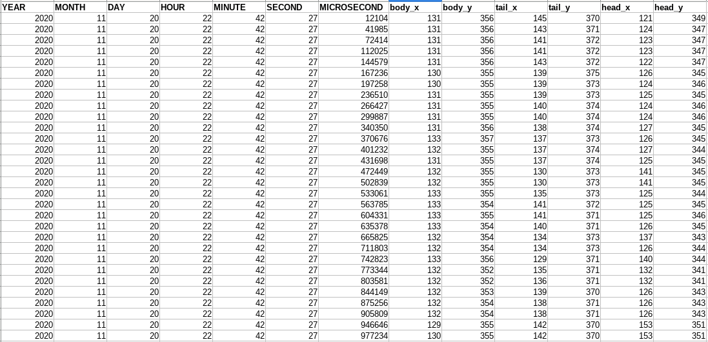
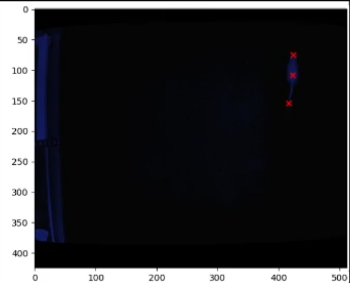
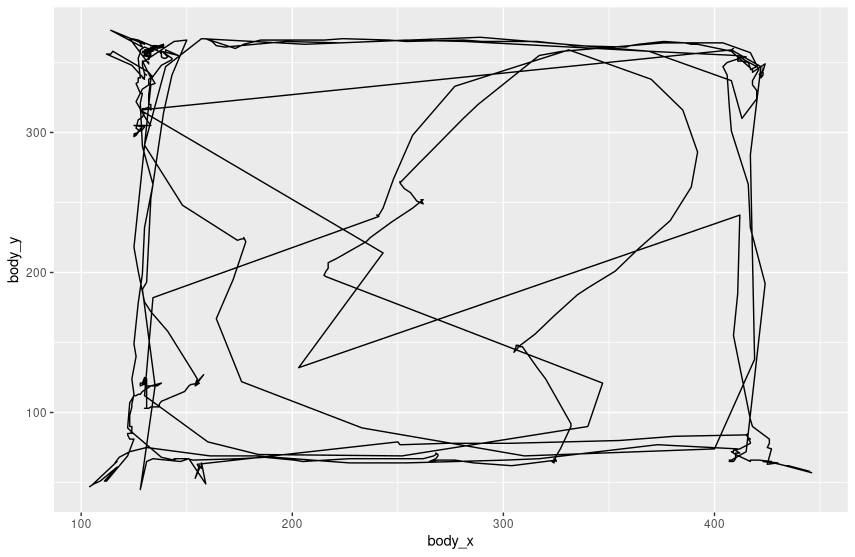

# Introduction

- Animal behavior quantification is at the base of multiple scientific questions
- Manual annotation is slow a cumbersome
- Drawing from open source codebases, simple and tailored solution can be achieved
- Computer vision algorithms can segment, identify and categorize in a frame by frame basis
- Allows for richer analysis

# What do I want to achieve?

1. Control parallel (4 or more) mice recordings
2. Obtain where are the 'points of interest' at every frame
3. Synchronize 'points of interest' acquisition with other instruments
4. Do further analysis in 'points of interest'

# How do I plan to do it?

1. Using open source image processing libraries (python)
	- For managing the 'data' side
2. GNU/UNIX libre tools
	- For managing the 'parallelization' part
3. Previously published segmentation and detection algorithms 
	- To create a lightweight and efficient implementation

# What are my 'restrictions'?

1. Live data processing
2. Must run in 'low end' software (raspberry pi 3)
3. Modular enough to add further data processing
4. Open source / libre / free / etc...

# Why am I doing this?

- Intellectual challenge
	- There are many open source software that achieve similar goals
	- Coding skills acquired:
		- Reading documentation
		- Managing and reading code (using git)
		- Bug fixing and general problem solving
	- Opens the possibility of 'extending' functionality
- It offers some slight advantages as is tailored to the lab objectives

# Comparison: General purpose tracking

- Ethoflow [@MJG2B69H#Bernardes_Etal_2020]
	- Designed for heterogenous backgrounds
	- GUI based
		- More user friendly
		- Not that compatible with GNU tools
		- Less extensible (harder to extend)
	- Instance segementation
		- Way better results, segments every object
		- More computationally intensive
		- Live segementation is around >1 fps in pi 3
	- Better object estimation
		- Detection is general, not intended for mice/rat
		- Background estimation is a every frame

# Comparison: Specific purpose tracking

- DeepLabCut [@MNYQ8CDJ#Mathis_Etal_2018]
	- Extremely powerful
		- Requires tensor flow
		- GUI-based
		- Requires neural network training
- Tracktor [@C5XQ2VT5#Sridhar_Roche_Gingins_2019]
	- Uses a similar idea
	- Lightweight and fast
	- Extensible due to minimalist codebase
	- Background estimation
		- Unnecessary in our case
	- Not designed for parallel or remote control

# Conclusion

- General view of features
- Too many features = slow in 'low end' machine
- Closed source (like Any-maze) are more featured
	- No parallel design
	- Not extensible, at least, in a 'live' setup
- This project draws form many open source code bases
	- Contour estimation: [@C5XQ2VT5#Sridhar_Roche_Gingins_2019]
	- Detection algorithm: [@MRSMMDDG#BenShaul_2017; @B5WZ6BDZ#Patel_Etal_2014]
	- Segmentation: [@DY5RTFEW#Bradski_2000]

# Results

As my project was mainly software design, results are divided in:

- Implementation
	- How I managed to achieve the objectives
- Test results
	- Preliminary results

# Control parallel (4 or more) mice recordings

The project consists on two operational units

- Main computer
	- Sends instructions to Raspberrys Pi
	- Previews
	- Allows for calibrations
- Raspberrys Pi 3 (x4~)
	- Perform all the computation
	- Synchronizes with arduino 'lickometer'
	- Records behavioral test

# Control parallel (4 or more) mice recordings

- Codebase is managed with Git and hosted in Github
- Code is uploaded to Pi with bash scripts
- Secure Shell network protocol relies all instruction from main computer to Pi

# Must run in 'low end' software (raspberry pi 3)

- Pi cam NoIR V2 outputs 30-90 FPS
	- Whole image processing allows for stable 30 FPS

# Obtain where are the 'points of interest' at every frame

- At each time step:
	- Separate background from foreground
	- Get the head point
	- Get the "body" point
	- Get the tail point
	- Do further analysis with those points

# Ideal input

- First step is to have a good idea of what our background is
	- We can create a model (more, complex but better suited for environments with dynamic lighting)
	- Or we can assume that out background is never going to change (this is how I did it)
		- Main computer stores a 'background' image in every pi

# We can get an image of our background

{ width=70% }

# However a simple image is rather complex, because each pixel has 3 channels (red, green, blue)

{ width=15% }

# To simplify we turn it to gray scale (only 1 channel)

{ width=15% }

# However, we need to further process our background to make it 'smoother'

- We need to remove noise
	- Noise are 'details' that make an image harder to identify
	- In other words, denoising is equivalent to make an image more homogeneous, while preserving edges
	- A bilateral filter does such thing

# Noise image

{ width=40% }

# Noise image after bilateral filter

{ width=40% }

# Similar steps are applied to the image with the animal

{ width=50% }

# The next step is to substract the background from the image with the animal

- This is done by substracting pixel intensity
- The result is not good, some areas of the animal are considered background (black color)

{ width=50% }

# We use morphological transformations to fix this

- Morphological transformations are operations applied to binary images, which are based on the image shape
	- They use a 'kernel', which a windows where a certain operation is performed
- Our main problem is that there's background objects INSIDE the animal
	- The closing operation is applied to the kernel
		- A pixel element is defined as '1' if: inside the kernel there's atleast a '1' pixel (dilation)
		- Then we 'erode' the boundaries: a pixel is considered '1' is all pixels under the kernel are 1's, otherwise is 0

# Dilation

{ width=25% }
{ width=25% }

# Erosion

{ width=25% }
{ width=25% }

# Closing = dilation followed by erosion

{ width=50% }

# Result

{ width=50% }

# The original image is not ideal, but we can improve this and make it a more robust algorithm

- We can calculate the contours of the image
	- This makes it more robust against 'lighting artifacts'

{ width=50% }

# Artifact removal

- The algorithm simply calculates the contours of each objects, and selects the one with the bigger area
	- The image looks worse because the artifact is super big
	- In normal conditions an artifact like that can be removed manually

{ width=50% }

# After the segmentation problem, we need to find the head, body and tail

- The intuition is:
	- Rats/mice are 'chubby'
	- Long tails
	- 'small' head relative to the body
	- The tail is the furthest away point from the body
	- The head is the furthest away point from the tail

# The geodesic distance is the proper implementation to solve this

- The geodesic distance is a shortest path between 2 points in a certain space
	- We define our space as the animal surrounded by boundaries (background)
	- The distance, considering the boundaries, is the geodesic distance
	- Is approximated by the fast marching algorithm

# Geodesic vs euclidean distance

{ width=50% }

# Considering this, the furthest away point is the 'body' because the animal is 'chubby'

{ width=50% }

# Detecting the head and the tail is relatively simple

{ width=50% }

# Demo

{ width=75% }

# Synchronize 'points of interest' acquisition with other instruments

- Other instruments 'timestamp' every data points with microsecond precision
- Pi also does this
- Data is synchronized 'offline' finding nearest time point 

# Do further analysis in 'points of interest'

	ggplot(data, aes(x=body_x, y=body_y)) + geom_path()

{ width=70% }

# How to implement the system

{ width=65% }

# Conclusions

- Creating a custom software for tracking is not as time consuming:
	- Many implementation are open source, so code can be re used
	- Python libraries are flexible enough, there's no need to extend them
- Modular design and GNU tools allows to easily extend software functionality
- Image processing can be done live
- Further data analysis can be done in programming language of choice
- If more powerful analysis is required to be done live, computing can be performed by more powerful computers or increasing the number of Pi

# Codebase

https://github.com/nicolasluarte/uni/tree/master/PHD/tracking_device

# References {.allowframebreaks} 
