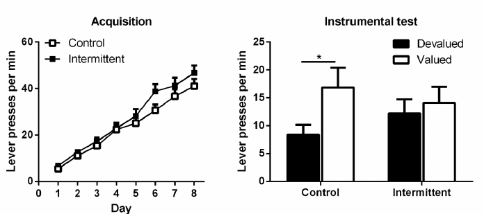

# Introduction

- Palatable food impairs goal-directed behavior, specifically by reducing performance in food-seeking behavior [@5REMJA6P#Furlong_Etal_2014].
- Goal-directed behavior considers (a) food expectation and (b) the motivational value of the food

# Introduction

- If food is devaluated, motivation should drop
- Devaluation can happen due to sensory-specific satiety

# Introduction

- Sensory-specific devaluation is too selective devalue a specific type of food
- Devaluation is measured in subsequent intake reduction or actions required for its acquisition
- Devaluation is specific for the type of food

# Research question

- Palatable food impairs goal-directed behavior
- Goal-directed behavior impairment is not responding to sensory-specific devaluation
- Do similar effects happen when altering eating patterns?

# Research question: background

- Intermittent diet -> restriction followed by refeeding
- With chow -> promotes persistent binge-like eating [@Y95YVAMZ#Hagan_Moss_1997]
- 'Sensory-specific satiety is also disrupted following binge-like feeding in rats'
- Intermittent feeding can alter consummatory behavior

# Research question: more precisely

- Does restriction + refeeding promotes habitual food-seeking behavior?
	- Goal-directed: behavior is modified by outcome value
	- Habitual: behavior **not** modified by outcome value

# Testing the question: material and methods

- 46 male long evans rats (2-3 per box)
- Food-restricted to 85-90% of weight
- Test chamber
	- Pellet A = grain food pellet (more protein)
	- Pellet B = purified pellet (more fat)

# Testing the question: procedures

## Training

- 5 days of food restriction
- 2 sessions of magazine training
- Operant chamber pellets delivered on a random time (60s)
- 40 outcomes per session; 20 pellet A; 20 pellet B

# Testing the question: procedures

## Training

- 8 days of instrumental learning
- Left/Right lever; A/B pellet
- Maximum outcome was 40/40
- days 1-2: FR1
- days 3-5: RR5 -> $P(x = 1) = 1/5$
- days 6-8: RR10 -> $P(x = 1) = 1/10$

# Testing the question: restriction + refeeding cycles

- Done post instrumental learning
- Intermittent = 23; Control = 23 rats
- Intermittent:
	- 4 days of restricted access (10gr)
	- 2 days of unrestricted access
	- 5 cycles of that
- Control:
	- 20 days of restricted access
	- 10 days of unrestricted access
- 3 days of restriction prior to testing

# Testing the question: instrumental outcome devaluation test

- 1 hour access to one of the 2 pellets
- 3 min instrumental choice extinction test (no outcome)
	- Lever presses were measured
- 48 hours after, rats were tested with the other pellet
- 24 hours after, sensory-specific satiety test

# Testing the question: sensory-specific satiety test

{ width=50% }

# Results: preliminaries

# Results: preliminaries

- Number of lever presses during training
	- Significant effect of session (they learned)
	- No effect of group
	- No group x session effect
- Weight
	- Percent weight lost was similar prior to testing

# Results: instrumental test

# Results: sensory-specific satiety

# Results: others

- Devaluation test:
	- No differences in consumption
	- Overall purified pellet was more consumed over grain
	- Pellet x group interaction was not significant

# Discussion

- Intermittent feeding, similar to palatable food, impair goal-directed behavior
- Impairment was not due to outcome devaluation insensitivity 
	- Devaluation effect were present on simultaneous test
	- Not present in sequential test
- Sequential test requires a representation of absent food (pre-feed)
	- Incentive memory impairment (?)
- Perhaps pellets were not different enough (?)
- Intermittent feeding = stress -> change to habitual control

# Discussion: my take

- Food intake is related to reward variability [@C3WTP7MN#Neuser_Etal_2020]
	- Having varied experiences related to food (intermittent), increases reward variability
	- Increased reward variability -> increased intake
- Ancient mechanism to prevent starvation due to uncertainty
- Food shortages increase intake [@NL4XYLRH#Forkman_1993]
- Not that good of alternative hypothesis because consumption was similar between groups
- Perhaps intake is not increased, but food value computation is not prioritized

# References {.allowframebreaks} 
