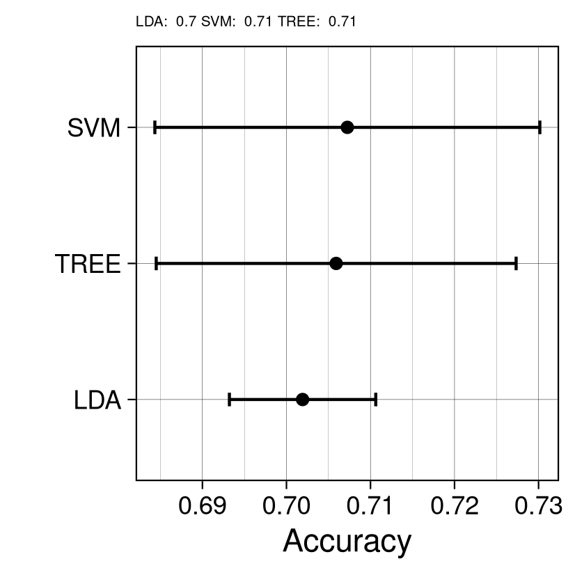

```{r setup, include=FALSE}
knitr::opts_chunk$set(echo = T, results = "hide",
warning=FALSE, message=FALSE, tidy.opts=list(width.cutoff=70), tidy=TRUE)
```


```{r}
#load libs
if(!require("pacman")) install.packages("pacman")
pacman::p_load(ggplot2, knitr, kableExtra, tidyverse, My.stepwise, reshape2, GGally, ggpubr, gtsummary, formatR, gt, olsrr, stargazer, boot, nnet, mlogit, xtable, generics, caret, rlist, pROC)
```

```{r}
# load the dataset
setwd('/home/nicoluarte/uni/PHD/stat_course')
dataSet <- as_tibble(read.csv('ENS.csv', sep=",", header=TRUE))
dataSet <- dataSet[-c(1), ]
head(dataSet)
```

1. Using the ENS 2016-17 database, build a multiclass logistic regression model to predict the cardiovascular risk obtained through the RCV CHILENO RECODIFICADO (low risk = 1, moderate risk = 2 and high risk = 3).

a. Use a multiclass logistic regression model with all predictors and present the results including p values

```{r}
# recode variables
# and drop rows with at least 1 NA
dataFinal <- dataSet %>% type_convert(cols(
			      Sexo = col_factor(),
			      Glucosa = col_double(),
			      Colesterol_HDL = col_double(),
			      Colesterol_Total = col_double(),
			      m2p11a_PAS = col_double(),
			      m2p11a_PAD = col_double(),
			      m7p3 = col_double(),
			      ta3 = col_double(),
			      IMC = col_double(),
			      RCV_CHILENO_RECODIFICADO = col_factor()
			      )) %>% drop_na()
```

```{r, results='asis'}
# fit model
mdlData <- mlogit.data(dataFinal, shape="wide", choice="RCV_CHILENO_RECODIFICADO")
mdl <- mlogit(RCV_CHILENO_RECODIFICADO ~ 1 | Edad +
	       Sexo +
	       Glucosa +
	       Colesterol_HDL +
	       Colesterol_Total +
	       m2p11a_PAS + 
	       m2p11a_PAD +
	       m7p3 +
	       ta3 +
	       IMC, data = mdlData, reflevel="1")
summary(mdl)
stargazer(summary(mdl)$CoefTable, title='Model results')
```

b. Interpret the results obtained. What are the variables that have a significant contribution to the model? Was this result expected?

First the full model coefficients are significantly different from the null model (Log-likelihood = -1524.5; $\chi^2 = 1681.1$; p = < 0.001). Predictive ability of the model is modest with McFadden $R^2$ = 0.355. As for coefficients, all were significant in the model, except for smoking and alcohol consumption. Coeffients are reported with coronary risk score '1' = low risk as reference. Considering age, we see a positive estimate for class '2' = moderate and class '3' = high risk, meaning that being older is more predictive of a higher coronary risk. More precisely, being 1 year older, increases the multinomial log-odds for coronary risk, relative to '1', would decrease by 0.029 and 0.08, for class '2' and '3', respectively. For sex, the comparison is female (Sexo1) against male (Sexo2), with negative coefficients meaning that females are less likely to have a moderate or high coronary risk score, compared to males and holding all other variables constant. Similarly, higher glucose increase the log-odds of moderate and higher risks. HDL cholesterol, unlike total cholesterol, may be a protective factor against cardiovascular risk, as higher levels predicts less log-odds for classes '2' and '3'. Increases in both type of blood pressure are related to greater cardiovascular risk. Finally higher BMI is also associated with higher risk of cardiovascular risk. Most of the coefficients estimates were not surprising as they are typically related to cardiovascular health, however, alcohol consumption not reaching significance did surprise me, as I would expect that increasing alcohol consumption would lead to a worse health status, including cardiovascular health. Perhaps, alcohol consumption effects are made effective via blood pressure, so controlling for blood pressure renders alcohol consumption not significant.

c. Calculate the probability of belonging to each of the categories predicted by the model for a subject with the following characteristics: Age: 46, Sex: female, Basal glucose: 95, Cholesterol: 194, HDL: 47, PAS: 128, PAD: 76, Daily alcohol consumption: No, Gr. Salt: 10, Smoking category: Ex-smoker (<6 months), BMI: 28. Interpret the result.

```{r, results='asis'}
newData <- data.frame(
		      Edad=46,
		      Sexo=factor(1, levels=c(1,2)),
		      Glucosa=95,
		      Colesterol_Total=194,
		      Colesterol_HDL=47,
		      m2p11a_PAS=128,
		      m2p11a_PAD=76,
		      m7p3=1,
		      ta3=1,
		      IMC=28,
		      # not relevant, only for reshaping
		      RCV_CHILENO_RECODIFICADO=factor(3, levels=c(1,2,3))

)
newDataL <- mlogit.data(newData, choice="RCV_CHILENO_RECODIFICADO", shape="wide")
probs <- data.frame(Risk = c('low', 'moderate', 'high'),
	   Probability = c(predict(mdl, newDataL)))
stargazer(probs, summary=FALSE, title='Category probability')
```

Given such values the most likely class is '2', meaning a person with such characteristics would be categorized, by the model, as 'moderate' cardiovascular risk. Which is expected as most positive coefficients were elevated in this simulated person.

2. Build a model based on discriminant analysis, another on support vector machines and another on trees to predict the cardiovascular risk obtained by the classification described above (low risk = 1, moderate risk = 2 and high risk = 3)

a. Use the Matlab Classification Learner App (or similar) to build the three models with all the predictors using 5-fold cross validation and report the accuracy obtained.

```{r}
#discriminant analysis
head(dataFinal)
# center and scale data
preproc <- c("center", "scale")
# setup cross validation
control <- trainControl(method="cv", number=5, savePredictions=TRUE)
# setup accuracy as metric
performance_metric <- "Accuracy"
LDAmdl <- train(RCV_CHILENO_RECODIFICADO ~ .,
		data = dataFinal %>% select(-c(IdEncuesta)),
		metric = performance_metric,
		trControl = control,
		preProcess = preproc,
		method = "lda"
		)
# support vector machine
# parameter C was optimized to render maximum accuracy
SVMmdl <- train(RCV_CHILENO_RECODIFICADO ~ .,
		data = dataFinal %>% select(-c(IdEncuesta)),
		metric = performance_metric,
		trControl = control,
		preProcess = preproc,
		method = "svmLinear",
		tuneGrid = expand.grid(C = seq(0.1, 2, length = 50))
		)
# tree model
# complexity parameter optimized to render maximum accuracy
TREEmdl <- train(RCV_CHILENO_RECODIFICADO ~ .,
		data = dataFinal %>% select(-c(IdEncuesta)),
		metric = performance_metric,
		trControl = control,
		preProcess = preproc,
		method = "rpart",
		tuneLength = 10
		)
results <- resamples(list(LDA = LDAmdl, SVM = SVMmdl, TREE = TREEmdl))
values <- as.data.frame(summary(results)$statistics$Accuracy)$Mean
title <- paste("LDA: ", round(values[1], 2),
	       "SVM: ", round(values[2], 2),
	       "TREE: ", round(values[3], 2), sep=" ")
ggplot(results) +
	labs(y = 'Accuracy',
	     title = title) +
	theme_linedraw() +
	theme(plot.title = element_text(size=5))
ggsave('accuracy.png',
       plot = last_plot(),
	width=7,
	height=7,
	units=c("cm"))
```


b. Obtain the confusion matrix and the percentage of true positives and false negatives for each class (for more than two classes this definition is quite ambiguous so just report the percentage of data classified correctly and the percentage of data classified incorrectly for each class). Compare the results of the three models.

```{r, results='asis'}
treeCM <- confusionMatrix(TREEmdl)$table
svmCM <- confusionMatrix(SVMmdl)$table  
ldaCM <- confusionMatrix(LDAmdl)$table
cmList <- list(TREE = treeCM,
	       SVM = svmCM,
	       LDA = ldaCM)

# correctly classified data per class
goodPerc <- 1:3 %>% map(function(x) list(cmList[[x]]['1','1'], cmList[[x]]['2','2'], cmList[[x]]['3','3'])) %>%
			list.stack() %>%
			rename(Low=V1, Moderate=V2, High=V3) %>%
			mutate(Model=names(cmList)) %>% 
			relocate(Model)

# incorrectly classified data per class
badPerc <- 1:3 %>% map(function(x) list(sum(cmList[[x]]['1',c('2','3')]),
			     sum(cmList[[x]]['2',c('1','3')]),
			     sum(cmList[[x]]['3',c('1','2')]))) %>%
			list.stack() %>%
			rename(Low=V1, Moderate=V2, High=V3) %>%
			mutate(Model=names(cmList)) %>%
			relocate(Model)

stargazer(goodPerc, summary=FALSE, title='Correct classification per Model per Class')
stargazer(badPerc, summary=FALSE, title='Incorrect classification per Model per Class')
```

All models correct and incorrect classifications are quite similar across all possible classes.

c. Obtain also the ROC curve and the area under the curve (AUC) choosing one of the classes as the positive class (you can use the one you want, just explain which one you chose). Compare the results of the three models.

```{r}
svmP <- ordered(SVMmdl$pred$pred, levels=c('1','2','3'))
svmMulti <- multiclass.roc(predictor=svmP, response=SVMmdl$pred$obs)
ldaP <- ordered(LDAmdl$pred$pred, levels=c('1','2','3'))
ldaMulti <- multiclass.roc(predictor=ldaP, response=LDAmdl$pred$obs)
treeP <- ordered(TREEmdl$pred$pred, levels=c('1','2','3'))
treeMulti <- multiclass.roc(predictor=treeP, response=TREEmdl$pred$obs)
svmRs <- svmMulti[['rocs']]
ldaRs <- ldaMulti[['rocs']]
treeRs <- treeMulti[['rocs']]
svmRocs <- list("Class 1 vs 3" = svmRs[[1]], "Class 1 vs 2" = svmRs[[2]], "Class 3 vs 2" = svmRs[[3]])
svmAUC <- list("Class 1 vs 3" = auc(svmRs[[1]]), "Class 1 vs 2" = auc(svmRs[[2]]), "Class 3 vs 2" = auc(svmRs[[3]]))
ldaRocs <- list("Class 1 vs 3" = ldaRs[[1]], "Class 1 vs 2" = ldaRs[[2]], "Class 3 vs 2" = ldaRs[[3]])
treeRocs <- list("Class 1 vs 3" = treeRs[[1]], "Class 1 vs 2" = treeRs[[2]], "Class 3 vs 2" = treeRs[[3]])
ggroc(svmRocs, aes="linetype", legacy.axes=TRUE) + geom_abline() +
	theme_classic() +
	labs(linetype="Comparisons")

```
