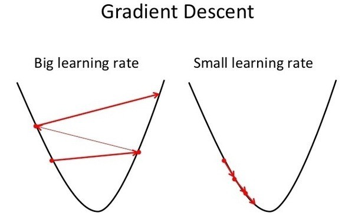

# Hipotesis

1. Establecer una o multiple condiciones
2. Establecer lo que pasara
3. Condiciones -> Lo que pasara

# Hipotesis

- Tanto las condiciones como lo que pasara son **ESTADOS**
- Una hipotesis entonces vincula **ESTADOS** de una manera especifica

# Hipotesis

- Si el vinculo resulta ser tal como lo especificamos anotamos y juntamos evidencia de ese vinculo
- Si el vinculo resulta **no** ser como lo especificamos anotamos y juntamos evidencia de ese vinculo
- Cual es la diferencia?

# Error de predicción

- Si la hipotesis da en el clavo nuestro **MODELO** se mantiene igual
- Si la hipotesis **no** da en el clave debemos cambiar nuestro **MODELO**

# Una manera simple de calcular el error

$$ REALIDAD - PREDICCION $$

# Ejemplo concreto

- PREDICCION = sujeto A aumenta en 5% su sentadilla
- REALIDAD = sujeto A aumenta en 3% su sentadilla
- Error de prediccion = 3 - 5 = -2
- Si ajusto por el error de prediccion, mi siguente hipotesis debiese ser
	- sujeto A aumenta en 3% su sentadilla
	- PREDICCION + ERROR = nueva hipotesis
		- 3% - (-2%) = 3% + 2% = 5%

# Ejemplo concreto 2

- PREDICCION = sujeto A aumento en 3% su sentadilla
- REALIDAD = sujeto A aumento en 10% su sentadilla
- Cual es el error de prediccion?
- Como debiese ajustar mi siguiente hipotesis?

# Solucion

- 10% - 3% = 7%
- PREDICCION - ERROR = nueva hipotesis
	- 3% + 7% = 10%

# Ejemplo concreto 3

- PREDICCION = sujeto A aumento en 7% su sentadilla
- REALIDAD = sujeto A aumento en 7% su sentadilla
- Cual es el error de prediccion?
- Como debiese ajustar mi siguiente hipotesis?

# Solucion

- 0%
- No hacer nada

# Las cosas no son siempre blanco y negro...

- A veces las ganancias de un ciclo se deben a factores externos
- Tenemos que tener alguna medida de lidiar con esto
- **TASA DE APRENDIZAJE**
	- Cuanto aprendemos de cada ciclo

# Tasa de aprendizaje

$$ PREDICCION := PREDICCION + \alpha (REALIDAD - PREDICCION)$$

# Tasa de aprendizaje

- Que creen que pasa si $\alpha = 0$
- Que creen que pasa si $\alpha = 1$

# Tasa de aprendizaje

- Si $\alpha = 0$: no hay aprendizaje, siempre genera la misma hipotesis
- Si $\alpha = 1$: es 'miope' cree que la realidad son solo los resultados actuales, no cree que existe variacion en los resultados
- Entre mas cercanos a 0 mas escepticos, entre mas cercano a 1 mas 'creyente', hay que balancear

# Tasa de aprendizaje

# Reduccion de dimensionalidad

# Poniendo distancias en los protocolos

